# Break & Unbreak

## x) 

## a)
Environment: Debian13Trixie
- wget https://terokarvinen.com/hack-n-fix/teros-challenges.zip ja perään unzip teros-challenges.zip

# Muutin inspectiä, että pystyin lisäämään muutakin kuin numeroita

## b)

## c)

- En saanut sivua toimimaan
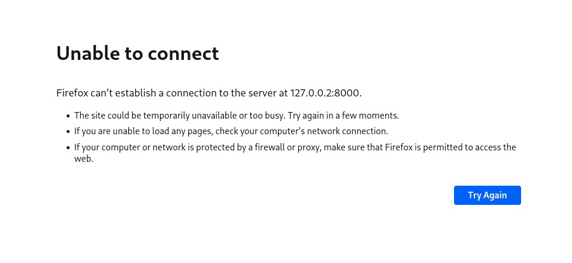
- Väärä hälytys
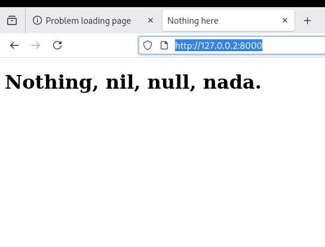
- Latasin ffuffin
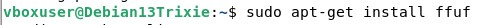
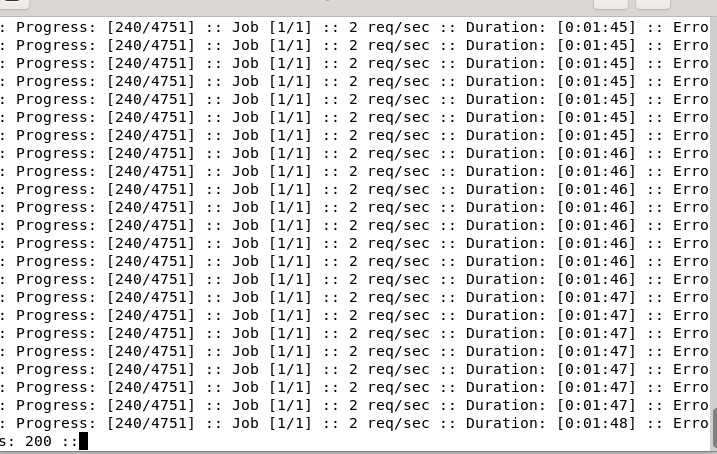
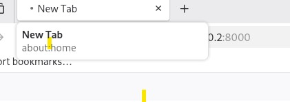

# Tässä kohti sivu ei enää latautunut ja meni hermo tehtävään

## d)

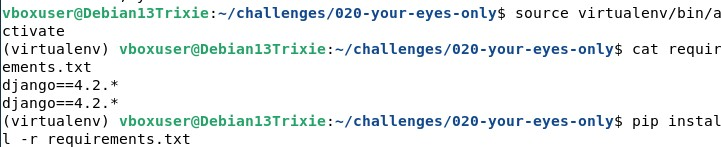
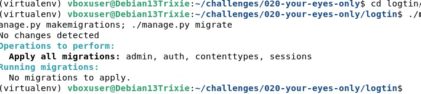
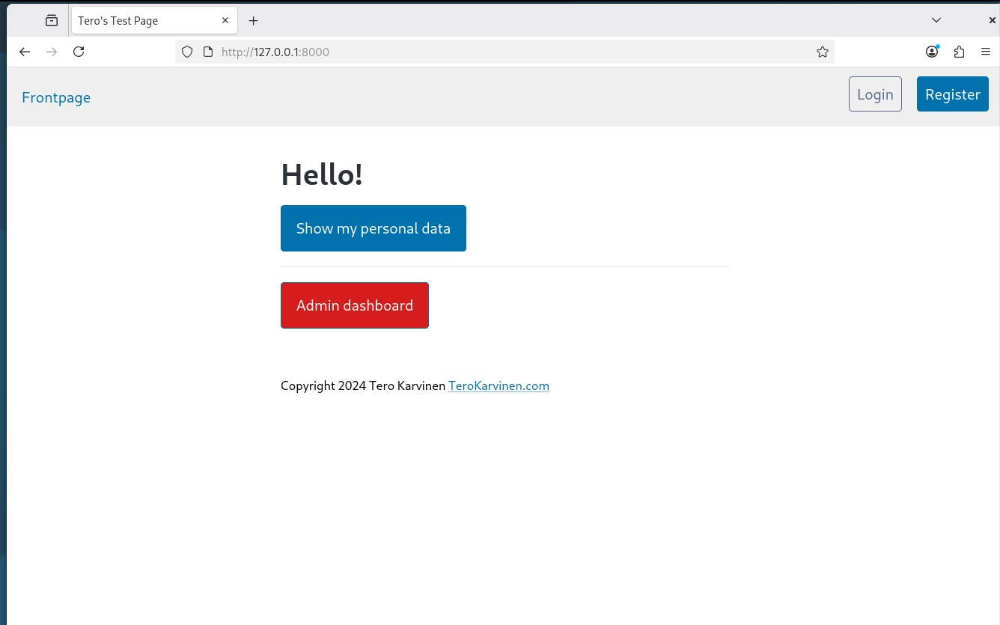
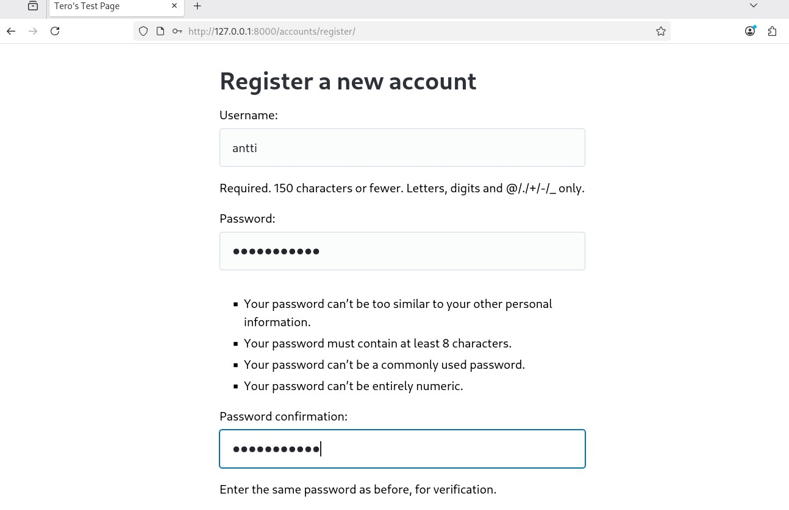
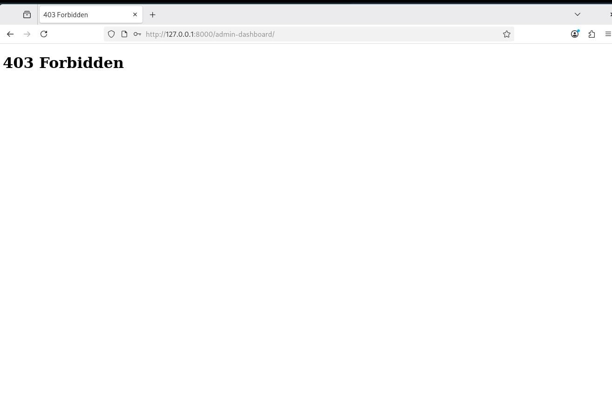
# Ratkaisu oli vaihtaa dashboard --> console
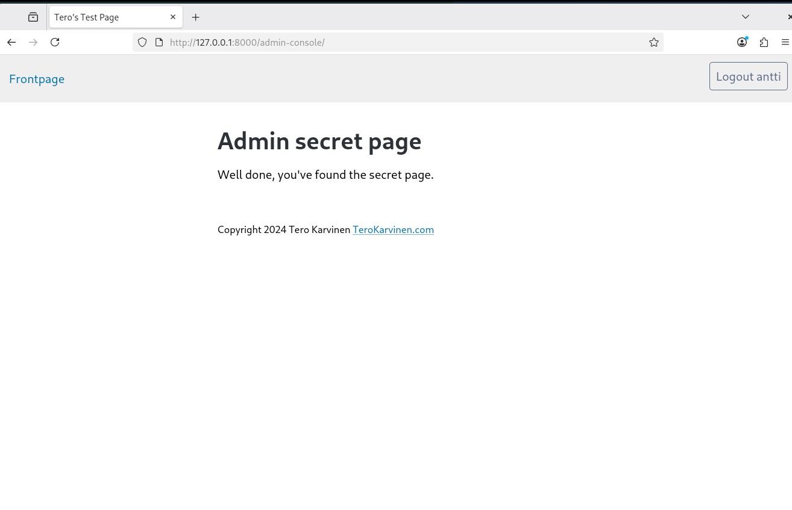

## e)
