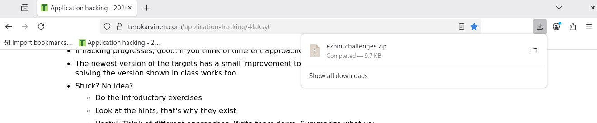
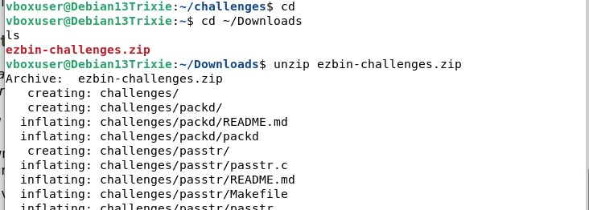
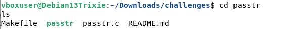
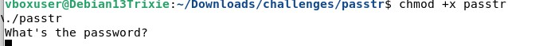
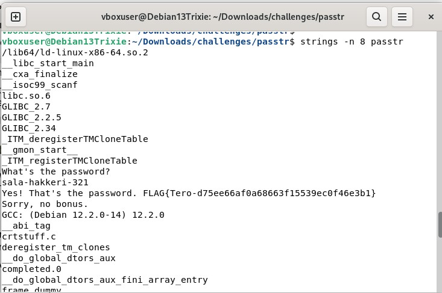
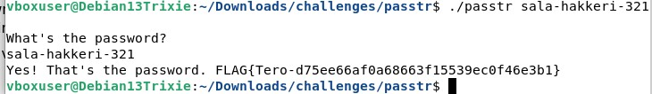
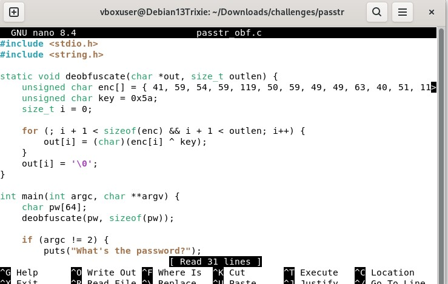
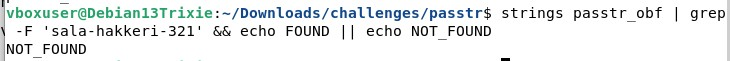

# h3 No strings attached.

## a)
- Latasin tiedoston

- Listasin sen ja unzippasin

- Siirryyin oikeaan diretoryyn

- Tutkin tiedostoa

- Käytin strings ja löysin salasanan 

- Ratkaisu: 

## b)
- Avasin nano tiedoston

- Vaihdoin rivin: unsigned char enc[] = { 41, 59, 54, 59, 119, 50, 59, 49, 49, 63, 40, 51, 119, 105, 104, 107, 0 }; --> volatile unsigned char enc[] = { 41, 59, 54, 59, 119, 50, 59, 49, 49, 63, 40, 51, 119, 105, 104, 107, 0 };

- Ratkaisu

## c)

- Ratkaisu: FLAG{Tero-0e3bed0a89d8851da933c64fefad4ff2}

