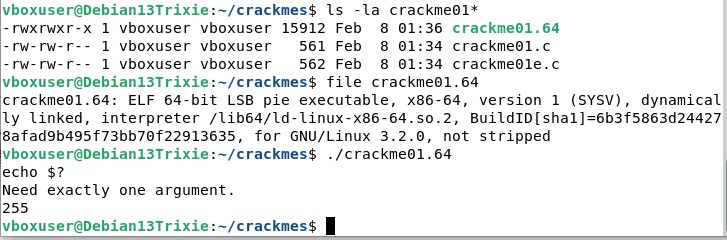
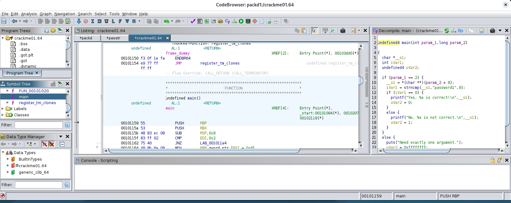
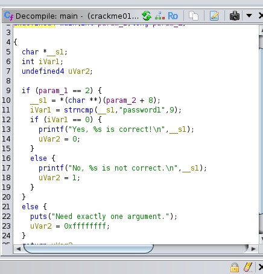
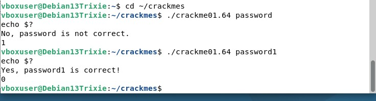
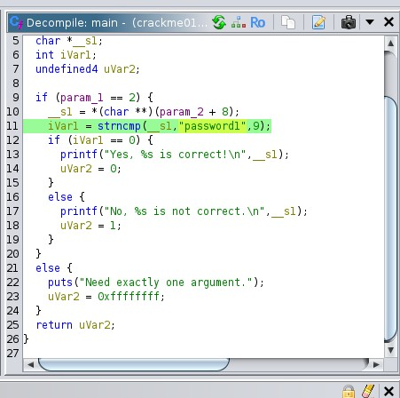

# h4 Some Disassembly Required

## x) 
Hammond 2022: Ghidra for Reverse Engineering (PicoCTF 2022 #42 'bbbloat') 
- Ghidra on open source projekti, joka on USA NAtional Security julkaisema
- Se on software reverse engineering työkalu 
a)
- 
- Ghidra on ladattu.

b) 
- Ghidran käyttö osottautui itselle todella hankalaksi
-  Tutkin Ghidraa
-  
-  
-  Functions --> Main ja decomplierista löytyy salasana
-  Ohjelma tulostaa kysymyksen whats the password, vertaa syötettä oikeaan salasanaan, jos väärä --> sorry no bonus.

c) 
- Ghidra kaatuilee ajoittain, joka häiritsee tehtävän tekemistä
-  
-  Functions --> Main
-  
-  Klikkaus kohdasta: if (iVar1 == 0)
-  
-  Kohta JNZ
-  
-  Muokkaa siihen JZ
-  ELi JNZ --> JZ, jolloin logiikka kääntyy. 
Testatessa terminaalissa logiikka toimi myös

d) 
- Tehtiin binääri
-  
-  Löytyi kohta iVar1 = strncmp....
-  
-  Vertaa --> password1 ja vertailu tehdään strncmp komennolla
-  
-  Ratkaisu
-  
-  
 ## Virtualbox kaatuilee ja aika loppuu kesken. Siirrän projektin pöytäkoneelleni, ja jatkan huomenna tehtäviä, jotta voin käyttää niihin kunnolla aikaa ja ymmärtää myös miten kaikki toimiii
