# h5 It's Alive!
a)
  - 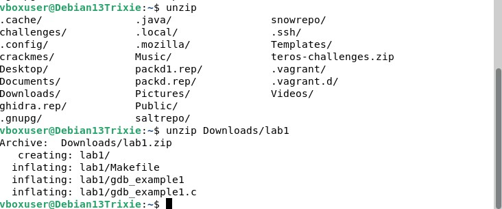
  - Purin zip tiedoston
  - 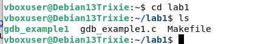
  - cd ja ls että tiedän sisällön
  - 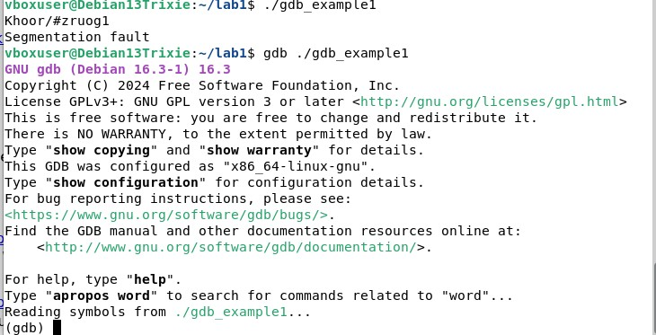
  - ajoin sen
  - 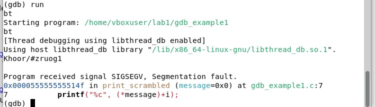
  - ajoin gdb:n sisällä ja ohjelma kaatui. ongelma löytyy 7. riviltä.
  - 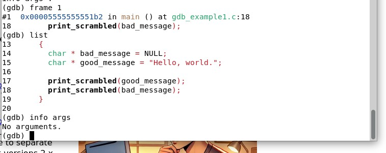
  - 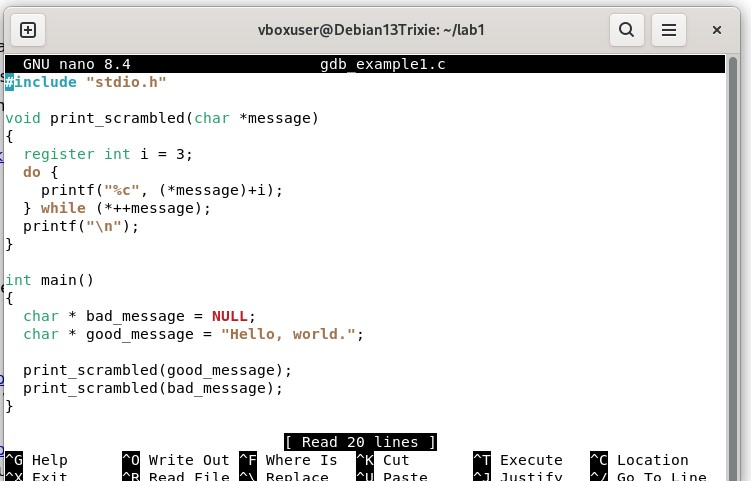
  - Kaatuminen johtuu null kohdasta, joten menin nanoon tutkimaan sitä.
  - 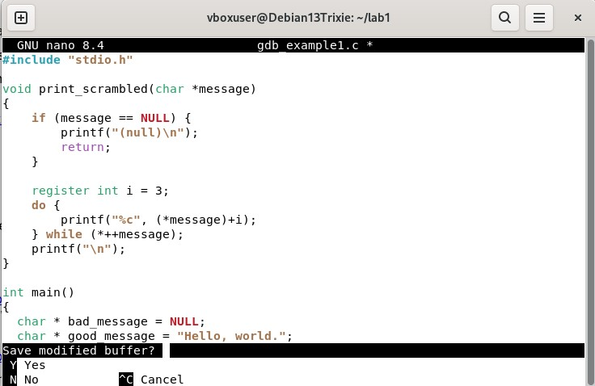
  - Lisäsin tarkistus funktion null kohtaan, joka korjaa sen.
  - 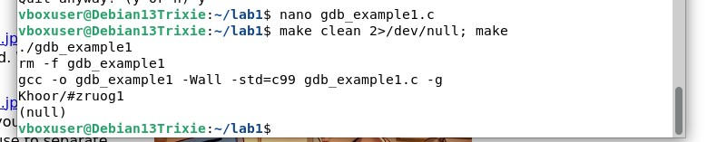
  - 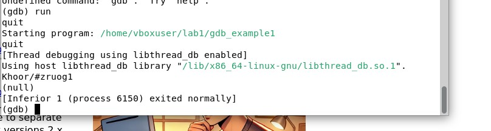
  - Korjausten jälkeen ohjelma toimii.

b)

- 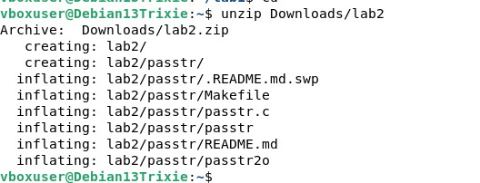
- Unzippaus
- 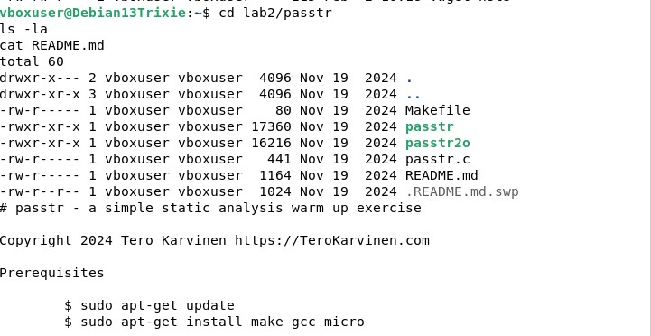
- Siirtyminen ja listaus
- 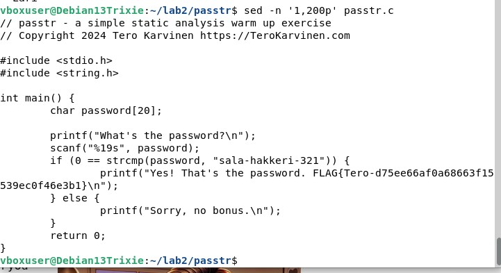
- Lähdekoodin tarkastaminen ja sieltä löytyi salasana ja lippu
- 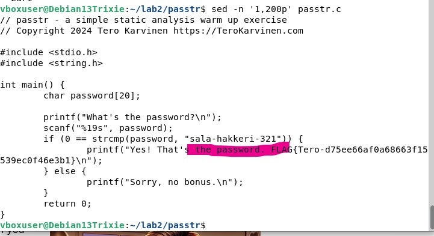
- salasana
- 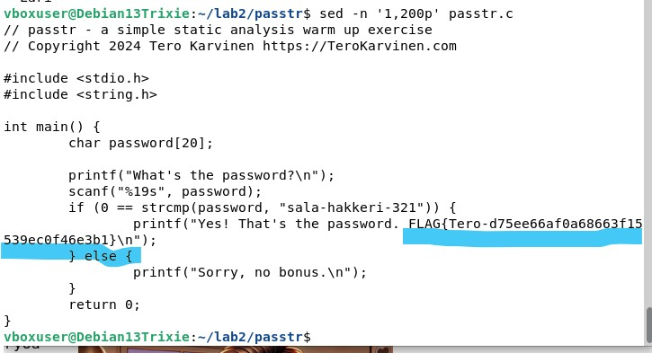
- lippu

C)

## Crack me 3

- 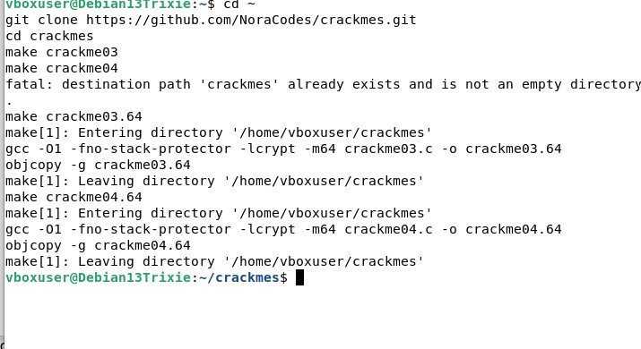
- Kloonasin gitin
- 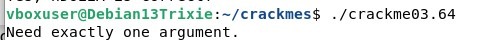
- 
- 
- 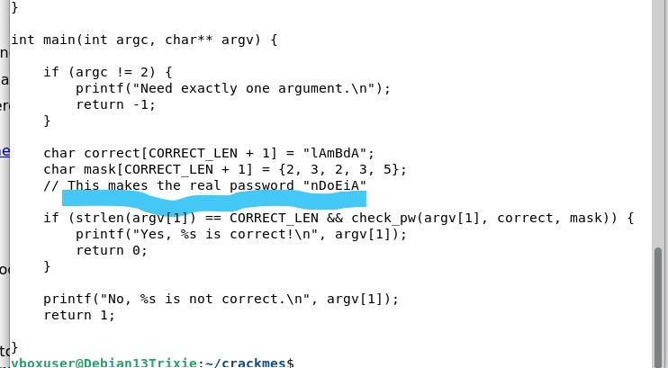
- 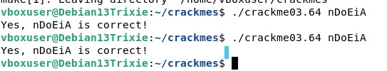

## Crack me 4

- 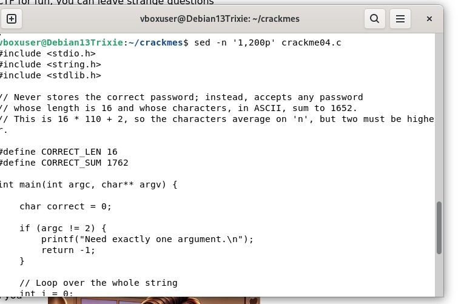-
- 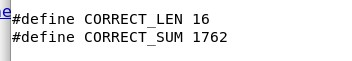

- Ascii  summan täytyy olla 1762
- Arvo N:lle on 110
- 14x110 on 1540
- O:N arvo on 111
- 111 x 2 = 222
- 1540 + 222 = 1762
- Eli nnnnnnnnnnnnnn + oo = 1762
- 
