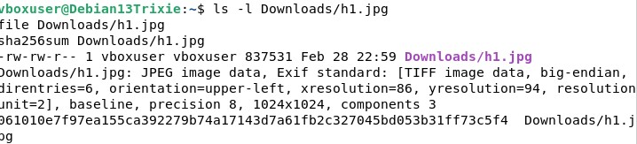
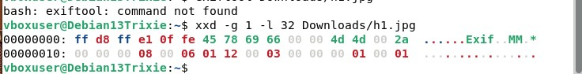
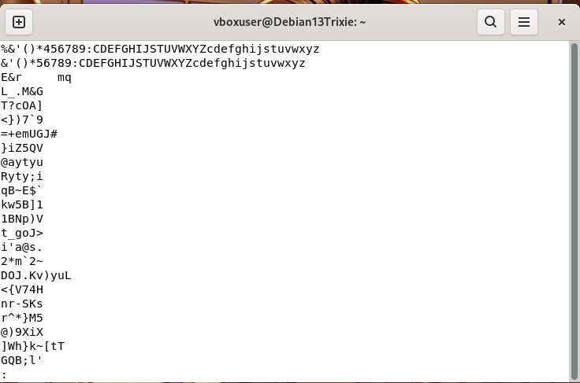
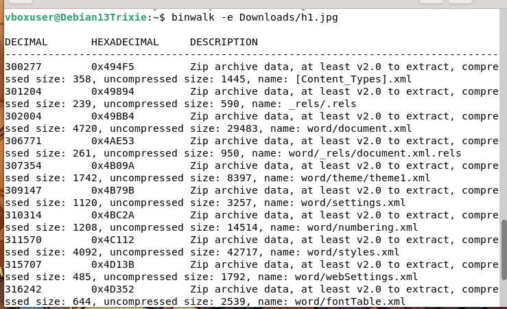
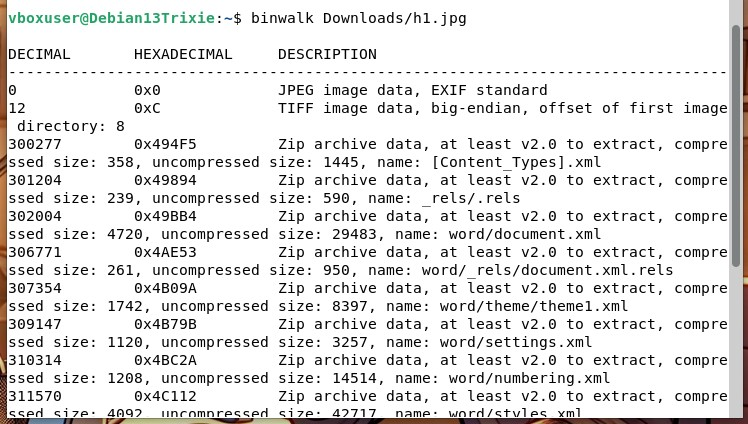
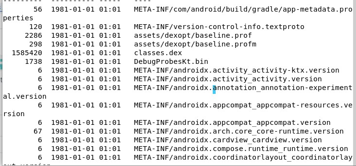
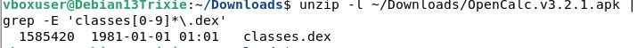
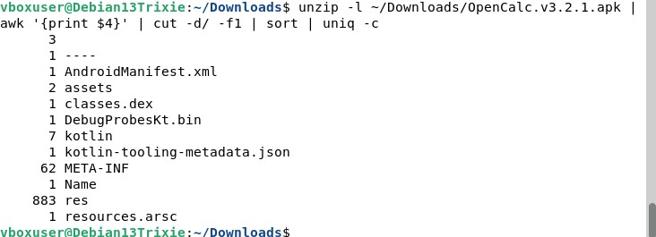
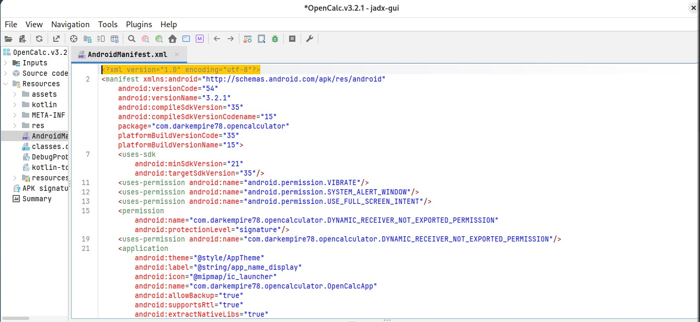

- 
-  
- 
 - 
 - Strings
  -
- b)
 - 
 

c)
  unzip -l ~/Downloads/OpenCalc.v3.2.1.apk | tail -n 40
-  

-  

unzip -l ~/Downloads/OpenCalc.v3.2.1.apk | grep -E 'classes[0-9]*\.dex'

 - Sisältää yhden 1. dex tiedoston

unzip -l ~/Downloads/OpenCalc.v3.2.1.apk | grep '\.so$' | head

- Ei löydy native kirjastoa

-  

-  
  ## Perustiedot:
- Sovellus / package: com.darkempire78.opencalculator
- VersionName: 3.2.1
- VersionCode: 54
- compileSdkVersion: 35
- minSdkVersion: 21
- targetSdkVersion: 35
  ## Oikeudet:
- android.permission.VIBRATE
- android.permission.SYSTEM_ALERT_WINDOW
- android.permission.USE_FULL_SCREEN_INTENT
 ## Sovellus ei pyydä mitään internet tai sijainti tietoja.
