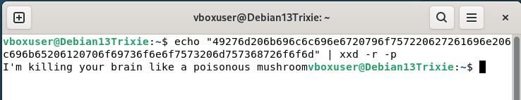
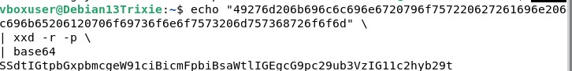
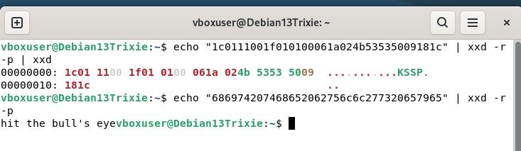
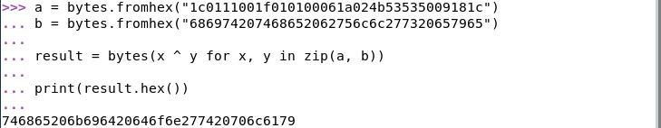
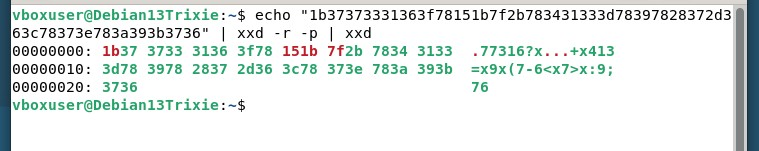
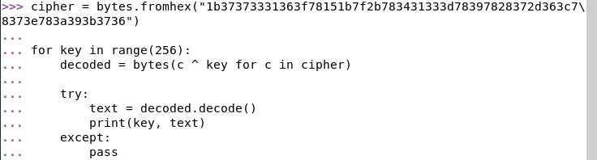
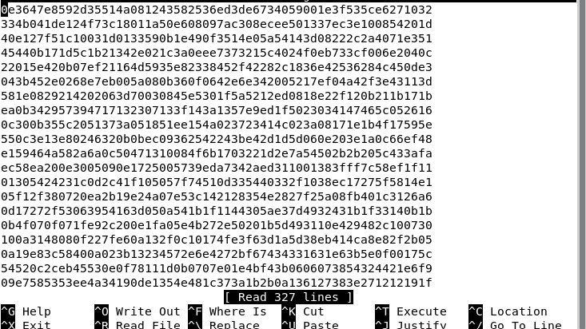
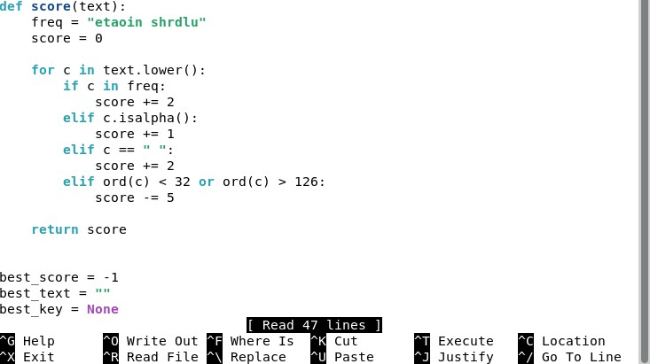
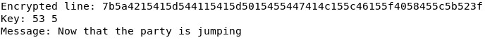

# Uhagre2

## x) Lue/tiivistä

## 1.1 TERMINOLOGY
- Kryptanalyysi tarkoittaa salatun tiedon selvittämistä ilman, että avain siihen on tiedossa.
- Erilaisia hyökkäyksiä ovat esim. ciphertext-only, known-plaintext, chosen-plaintext ja adaptive chosen-plaintext.
- Cryptography on viestien suojausta ja cryptanalysis niiden murtamista.

## 1.4 SIMPLE XOR
- Xor eli exlusive-or, tulos on 1 vain silloin kun bitit ovat erilaiset 
- XOR salaus on yleensä helppo rikkoa
- Avaimen voi selvittää index of coincidence menetelmällä

## 1.7 LARGE NUMBERS
- Kryptografiassa käytetään suuria lukuja kuvaamaan esim. hyökkäyksien vaikeutta
- Lukujen ymmärtämistä helpottaa niiden vertaaminen konkreettisiin asioihin, vaikkapa lottovoiton mahdollisuuteen

## a) 1. Convert hex to base64.
- Sivulla näkyy hex, jonka tunnistaa kirjaimista a-f ja numeroista 0-9.
- Muutan sen linuxissa --> bytes, käytän siihen xxd:tä
- 
- Sitten samalla työkalulla bytes --> base64
- 
- Tulos: SSdtIGtpbGxpbmcgeW91ciBicmFpbiBsaWtlIGEgcG9pc29ub3VzIG11c2hyb29t

## b) 2. Fixed XOR.
- On kaksi hex merkkijonoa
- 1c0111001f010100061a024b53535009181c
- 686974207468652062756c6c277320657965
- xxd:llä hex --> bytes
- 
- Sitten python scriptillä:
- 
- Tulos: 746865206b696420646f6e277420706c6179

## c) 3. Single-byte XOR cipher.
- Cipher: 1b37373331363f78151b7f2b783431333d78397828372d363c78373e783a393b3736
- Xor salaus
- 
- Python scripti:
- 
- 
- Ensimmäinen kirjain on C = 67
- Cipherin ensimmäinen tavu 1b = 27
- 27 XOR 67
- 27 = 00011011 binäärinä
- 67 = 01000011 binäärinä
- = 01011000 = 88 takaisin numeroksi muunnettuna
- ASCII 88 = X
- Avain: X
## d) 4. Detect single-character XOR
- Tein nano tiedoston johon liitin saaman datan
- 
- Sitten saman tyylinen script kuin tehtävä 3. käytin tekoälyä apuna.
- 
- Sitten ohjelman ajo: "python3 detect_xor.py"
- 

## Lähteet: 
€ Schneier 2015: Applied Cryptography, 20ed: Chapter 1: Foundations:
1.1 Terminology ("Historical Terms" to the end)
1.4 Simple XOR
1.7 Large Numbers
Karvinen 2024: Python Basics for Hackers
